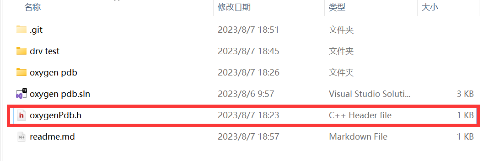
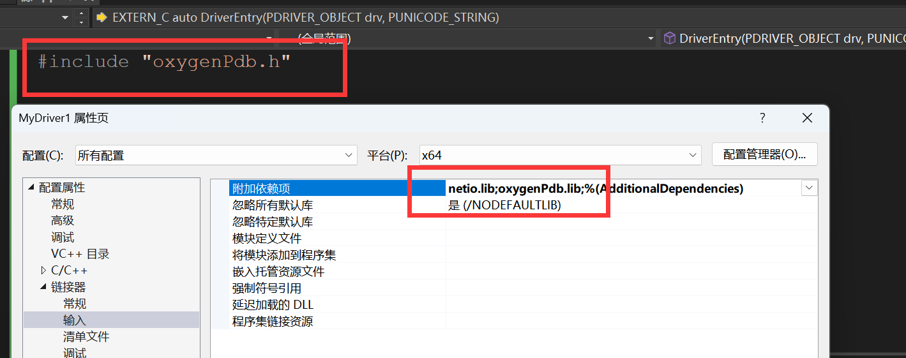
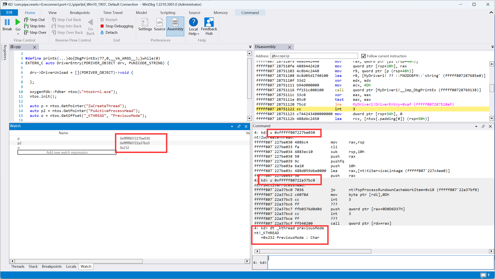
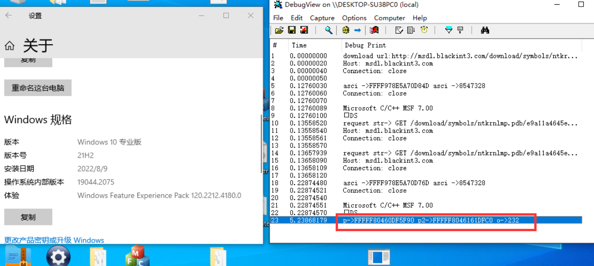
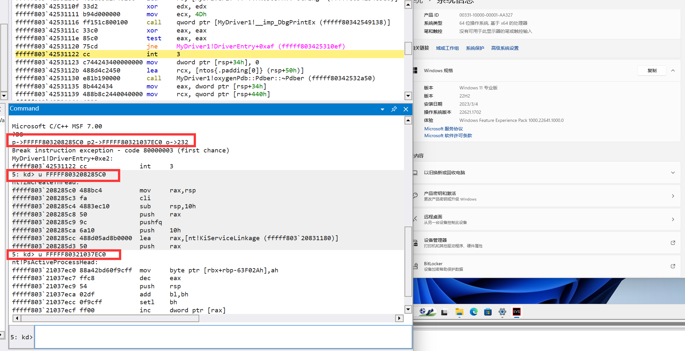

# Introduction

- oxygenPdb lib是一个纯内核没有R3程序的windows内核Pdb解析库,它可以完成从服务器自动下载当前操作系统版本的PDB文件并进行解析

- **oxygenPdb lib is a Windows kernel Pdb parsing library that running purely in kernel mode without any R3 programs. It can automatically download the PDB file of the current operating system version from the server and parse it.**
- 它使用非常简单,仅需要引入一个lib文件和头文件即可,vs的解决方案中的drvTest这个项目演示了如何使用。

- **It's very easy to use; you just need to include one lib file and a header file. The 'drvTest' project in the Visual Studio solution demonstrates how to use it**

# How to use

- 首先直接编译lib库(或者直接找到演示项目`drv test`的include目录),得到oxygen,然后找到和`.sln`同目录的`oxygenPdb.h`这个头文件;
- **First, compile the lib library (or directly locate the demo project `drv test`'s include directory) to obtain `oxygen`. Then find the `oxygenPdb.h` header file in the same directory as the `.sln`.**



- 然后在你的项目中引入`oxygenPdb.lib`和`NetIo.lib`,引入`oxygenPdb.h`头文件
- **Then, in your project, include both `oxygenPdb.lib` and `NetIo.lib`, and also include the `oxygenPdb.h` header file**



# Demonstration 

- 在引入头文件和库之后,使用如下代码
- **After including the header file and library, use the following code:**

```C++
#include "oxygenPdb.h"

#define printk(...)do{DbgPrintEx(77,0,__VA_ARGS__);}while(0)
EXTERN_C auto DriverEntry(PDRIVER_OBJECT drv, PUNICODE_STRING) {

  drv->DriverUnload = [](PDRIVER_OBJECT)->void {

  };

  oxygenPdb::Pdber ntos(L"ntoskrnl.exe");
  ntos.init();

  auto p = ntos.GetPointer("ZwCreateThread");
  auto p2 = ntos.GetPointer("PsActiveProcessHead");
  auto o = ntos.GetOffset("_KTHREAD", "PreviousMode");

  printk("p->%p p2->%p o->%x\r\n", p, p2, o);
  return STATUS_SUCCESS;
}
```

## win buildnumber 1903



## win buildnumber 19044



## win 11 22h2



# Thanks

I must extend my gratitude to the eminent air14 for his project https://github.com/Air14/SymbolicAccess. My Pdb parsing is largely based on his work.In fact, he has already perfectly accomplished the same functionality as my project. However, using SymbolicAccess is somewhat cumbersome。

I also want to thank the official LLVM website for providing some documentation about the pdb structure.

I am grateful to wbenny for his project https://github.com/wbenny/KSOCKET/issues, which enabled me to use kernel sockets for HTTP GET requests to download PDB files.